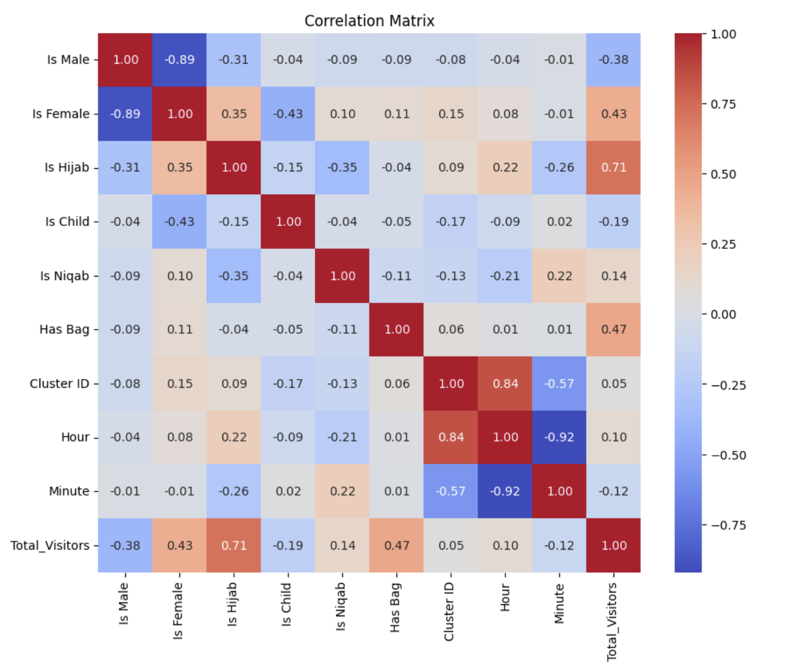

# Question Answering for CSV file

This project provides a system for exploring and querying visitor data, answering questions like "Who is my most common visitor?" and "When did I get the most visits?" It combines data analysis and natural language processing to provide insights into visitor patterns.

## Overview

The application processes a dataset containing visitor information and responds to various queries using Python. It leverages libraries like pandas for data manipulation and transformers for natural language processing (NLP).

## Dataset Description

the original data:

- **Is Male**: time consist of date and hours , minutes and seconds
- **Is Male**: Indicates if the visitor is male.
- **Is Female**: Indicates if the visitor is female.
- **Is Hijab**: Indicates if the visitor is wearing a hijab.
- **Is Child**: Indicates if the visitor is a child.
- **Is Niqab**: Indicates if the visitor is wearing a niqab.
- **Has Bag**: Indicates if the visitor is carrying a bag.
- **Cluster ID**: A unique identifier for each visitor group.

### Additional Data Processing

In this project, further processing was performed on the dataset to extract valuable information from the 'Time' column. This enriched dataset now includes several columns representing various visitor attributes:

- **Is Male**: Indicates if the visitor is male.
- **Is Female**: Indicates if the visitor is female.
- **Is Hijab**: Indicates if the visitor is wearing a hijab.
- **Is Child**: Indicates if the visitor is a child.
- **Is Niqab**: Indicates if the visitor is wearing a niqab.
- **Has Bag**: Indicates if the visitor is carrying a bag.
- **Cluster ID**: A unique identifier for each visitor group.
- **Date**: The date of the visit.
- **Hour**: The hour during which the visit occurred.
- **Minute**: The minute during which the visit occurred.
- **Total Visitors**: The total number of visitors.

## Key Features

**Data Exploration**:

- The application begins by exploring the dataset, displaying its structure to understand the columns and their contents.

- It calculates summary statistics for each column, providing insights into the distribution of visitor attributes.

Plot Correlation:



## Correlation Matrix Analysis

### Overview

This section provides insights derived from the correlation matrix of the dataset. Correlation values range between -1 and 1, indicating the strength and direction of the relationship between two variables.

### Key Insights

1. **Gender-Based Observations**:
   - A strong inverse relationship exists between `Is Male` and `Is Female`, as expected in a binary gender classification.
   - Female visitors have a moderate positive correlation with total visitor count, indicating a higher female presence in the dataset.

2. **Visitor Attributes**:
   - Visitors wearing a hijab have a strong positive correlation with total visitors, suggesting that a significant portion of the visitors are hijab-wearing individuals.
   - A moderate inverse relationship exists between female visitors and child visitors.

3. **Bag Presence**:
   - There is a moderate positive correlation between visitors carrying bags and the total number of visitors.

4. **Temporal and Cluster Analysis**:
   - The hour and minute values show a strong inverse relationship, which may reflect specific trends in visitor traffic over time.
   - Cluster IDs are closely tied to specific hours, indicating that visitor distribution varies significantly across different time periods.

### Conclusion

These correlations provide a foundational understanding of the relationships between various attributes in the dataset, aiding in further analysis and decision-making.

## Getting Started

### Prerequisites

Before you start, ensure you have Python installed on your machine. You’ll also need to install the required packages.

### Installation

1. **Clone the repository**:

    ```bash
    git clone https://github.com/your-repo/visitor-data-query-processing.git
    ```

2. **Navigate to the project directory**:

    ```bash
    cd visitor-data-query-processing
    ```

3. **Install the dependencies**:

    ```bash
    pip install -r requirements.txt
    ```

### Running the Application

To run the application and see it in action:

```bash
python main.py
```

This will load the dataset, process some example queries, and display the results.

## How It Works

### Data Exploration

Upon starting, the application loads the dataset and provides an overview of its structure. This step is crucial to understanding what kind of queries can be answered based on the available data.

### Query Processing

The application uses a combination of pandas for data manipulation and transformers for NLP to answer queries. Here’s a breakdown of how it handles different types of questions:

- **"Which minute did I get the most visitors?"**
  - The application groups the data by minute and identifies the minute with the highest visitor count.

- **"Who is my most common visitor?"**
  - The system analyzes the visitor data to determine the most frequently occurring visitor type.

### Extending the System

The application is designed to be extensible. You can add more patterns to handle different types of queries or improve the existing logic to provide more detailed answers.

## Example Queries

Here are some of the questions the system can answer:

- "Who is my most common visitor?"
- "What time did I get most visits?"
- "How many females visited me?"
- "How many females visited me in my peak time?"
- "How many males visited me in my peak time?"
- "How many children visited me in my peak time?"

## Contributing

Contributions are welcome! If you have suggestions for improvements or new features, feel free to fork the repository and submit a pull request.
